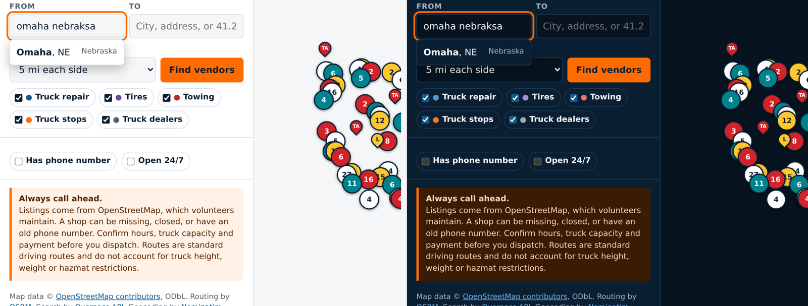
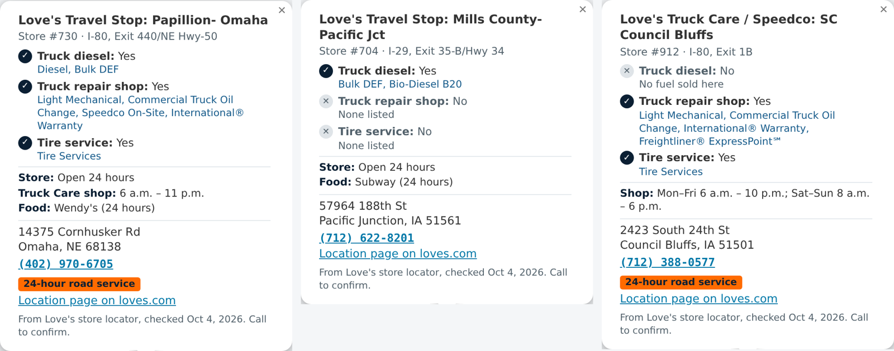
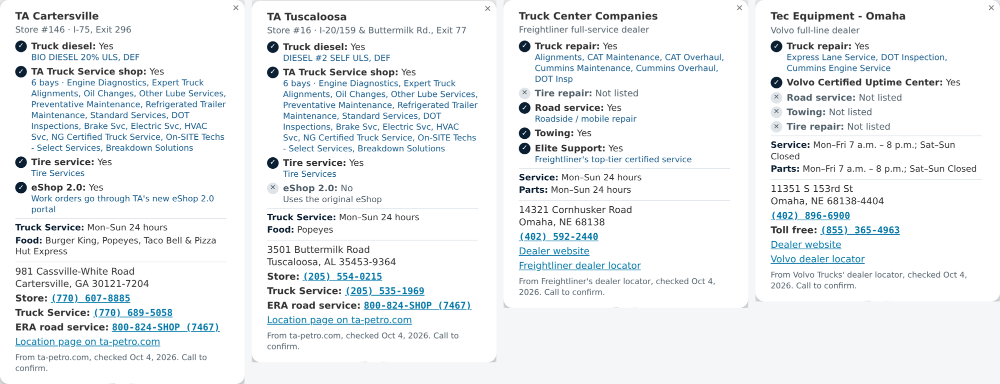
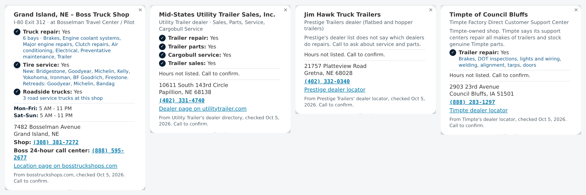
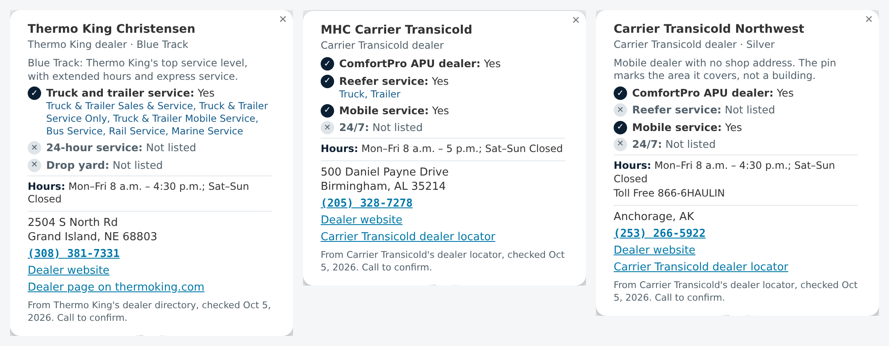
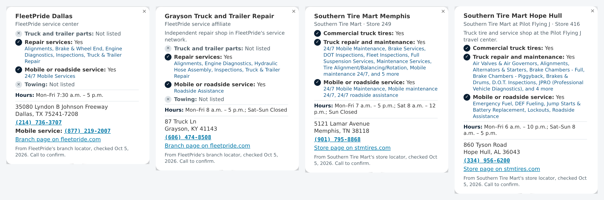
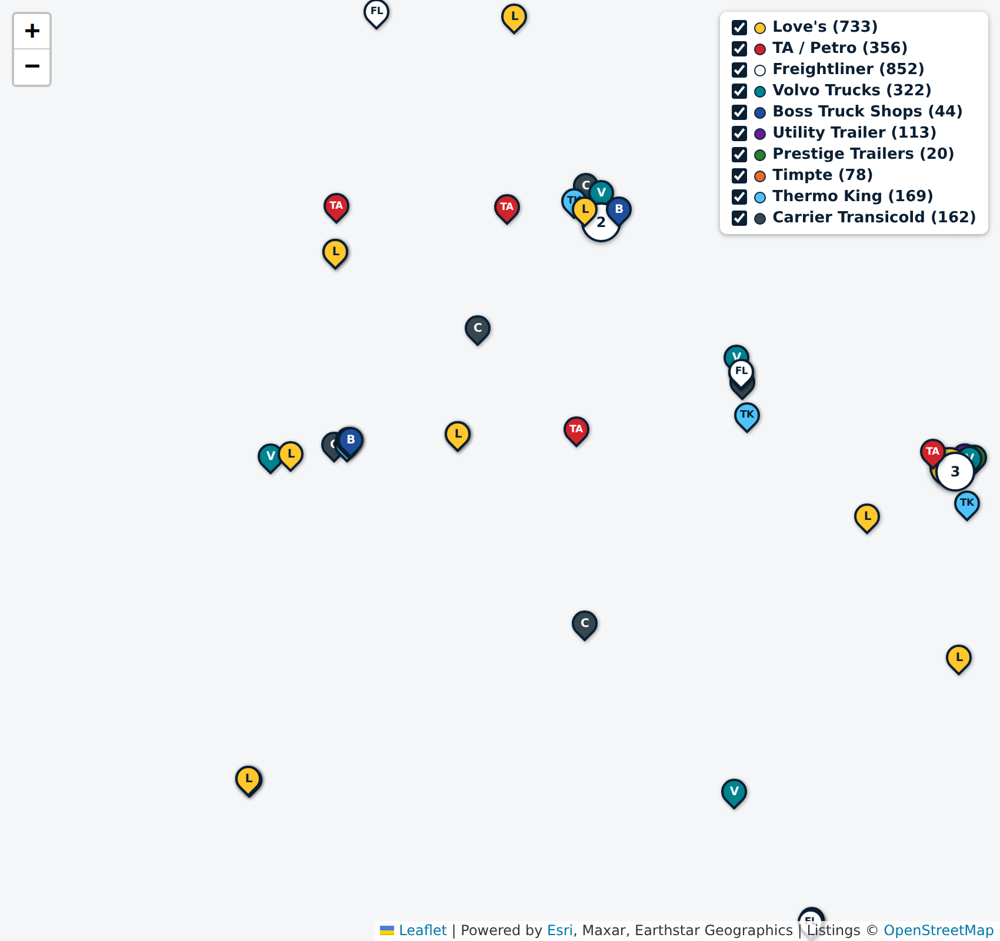

# OpenRoad Service Map

Find truck repair, tire, towing along a route for commercial vehicle road calls.

**Live site: https://canman555.github.io/OpenRoad-ServiceMap/**

A free, open source website for truck drivers and dispatchers setting up a road call. Enter a route, or where the truck is broken down, and it lists the locations of a set list of truck service companies near the route: Love's, TA/Petro, Freightliner, Volvo Trucks, Boss Truck Shops, Utility Trailer, Prestige Trailers, Timpte, Thermo King, Carrier Transicold, FleetPride and Southern Tire Mart. Results are sorted by route mile and have tap-to-call phone numbers.


## Why

When a truck breaks down, a driver or dispatcher has to find a shop that can handle a heavy truck, near a specific spot on the highway, fast. Most of that searching happens on general map apps that mix in car shops and don't show where along the route each one sits. This site narrows the search to truck services in a corridor along the route and puts the phone number first.

## Features

- **Along a route:** search 3 to 25 miles each side of a route between two places.
- **Near the truck:** search around an address, town, coordinates, or the phone's location.
- **City suggestions as you type** in From, To and Truck location, and they still match with typos ("omaha nebraksa" finds Omaha, NE). Picking one skips the online lookup.
- **Route mile for every result**, plus how far off route it is.
- **Tap-to-call** numbers, an "open 24 hours" filter, and a "has phone number" filter.
- **Copy info** button that copies name, phone, address, route mile and coordinates for dispatch.
- **Satellite view** using Esri World Imagery, with road and town labels.
- **Every Love's location in the US** (Travel Stops, Country Stores and Truck Care/Speedco shops) as yellow pins: **L** for Love's stores and **SC** for Love's standalone Speedco shops. Click or tap a pin for the address, phone number, highway exit, hours and a link to the location page on loves.com. Each popup says plainly whether the location sells truck diesel, has a truck repair shop and offers tire service.
- **TA, Petro and TA Express travel centers** as red TA pins. Popups show truck diesel, whether there is a TA Truck Service shop (bays, services, in-bay hours), tire service, and whether the shop uses TA's **eShop 2.0** portal or the original eShop.
- **Freightliner dealers and service points**, including Freightliner ExpressPoint at Love's and Speedco, as white FL pins. Popups show repair, tire, road service and towing, Elite Support, and service and parts hours.
- **Volvo Trucks dealers and service locations** as teal V pins. Popups show repair, Volvo Certified Uptime Center, road service, towing, tires, and service, parts and on-call hours.
- **Boss Truck Shops** as blue B pins. Popups show the interstate exit, the truck stop it sits in, service bays, repair work, tire brands, roadside service trucks, hours, and Boss's 24-hour call center.
- **Utility Trailer dealers** as purple U pins, with trailer repair, parts, Cargobull service and sales from Utility's dealer directory.
- **Prestige Trailers dealers** as green P pins. Prestige's list doesn't say which dealers do repairs, so the popup says to call.
- **Timpte** as orange Ti pins: Timpte's own Factory Direct Customer Support Centers (trailer repair for all makes) and Timpte equipment trailer dealers.
- **Thermo King dealers** as light blue **TK** pins, for reefer and APU work. Popups show the services offered, whether the dealer is Blue Track (Thermo King's top service level), 24-hour mobile service, drop yard and hours.
- **Carrier Transicold dealers** as charcoal **C** pins, including **ComfortPro APU** dealers. Popups say whether the dealer does APUs, reefer service, mobile service and 24/7, plus hours and dealer level.
- **FleetPride** as maroon **FP** pins: heavy-duty parts branches, FleetPride service centers, TruckPro stores and FleetPride's independent service affiliates. Popups show parts, repair services, mobile or roadside service, towing, hours and the mobile service phone.
- **Southern Tire Mart** as black **ST** pins with red letters, including its truck tire and service shops at Pilot Flying J travel centers. Popups show commercial truck tires, truck repair and maintenance, mobile or roadside service, and hours.
- A box at the top right of the map turns each brand on or off.
- Works on phones, with light and dark themes.
















## How it works (tech used)

It is one static file (`index.html`) with no server and no API keys, so it can be hosted free on GitHub Pages.

| Job | Service (free, public) |
| --- | --- |
| Map tiles | Esri World Imagery satellite with Esri road and place labels, via Leaflet 1.9.4 |
| Place search | Nominatim (US, Canada, Mexico), with komoot's Photon as the backup |
| City suggestions | `data/places.json`: every U.S. city, town and CDP from the Census Bureau's 2024 Gazetteer and population estimates (public domain), built by `scripts/build-places.mjs` |
| Route | OSRM public demo server, driving profile, with the FOSSGIS OSRM server (routing.openstreetmap.de) as the backup |
| Vendor search | The company location files in `data/` (listed below). The browser checks every location against the truck's spot or the route, so the search never waits on an outside server. |

Searches near the truck go out to 10, 50, 100, 200 or 250 miles; searches along a route cover 3 to 25 miles each side. The list shows the nearest 300 results. Clicking a result opens that company's pin on the map.

The map and the results show only the companies listed below. General shops from OpenStreetMap (car tire chains, auto repair, unrelated towing) were removed on 2026-10-05 so the site stays focused on these vendors.

### Many people at once

There is no shared server behind the page. Each visitor's browser does its own search, using the company location files on this site plus the public place-search and routing services, so two dispatchers looking up different routes at the same time never see or slow down each other's results. To keep searches working when a public server is busy:

- Every request has a time limit, and a busy answer (HTTP 429 or 5xx) gets one more try after a short wait.
- Vendor searches read files from this site, so they never wait on a busy public server.
- Place search and routing have backup servers. The page moves to the next one when a server fails.
- Answers are remembered for the visit, so running the same search again doesn't ask the servers twice.

## Love's locations

`data/loves.json` comes straight from Love's own store locator feed (the one behind loves.com/locations). The [Update Love's locations](.github/workflows/update-loves.yml) workflow runs `scripts/update-loves.mjs` every Monday and commits the file only when something changed, so addresses and phone numbers stay current without manual edits. Run it any time from the repo's Actions tab with "Run workflow".

## Other brand locations

The [Update brand locations](.github/workflows/update-vendors.yml) workflow runs every Monday and writes one file per brand, each from that company's own site:

| File | Source | Script |
| --- | --- | --- |
| `data/ta.json` | Every location page listed in the ta-petro.com sitemap, plus the eShop 2.0 site list on [ta-petro.com/fleets/eshop-2](https://www.ta-petro.com/fleets/eshop-2) | `scripts/update-ta.mjs` |
| `data/freightliner.json` | Freightliner's dealer search (freightliner.com/dealer-search) | `scripts/update-freightliner.mjs` |
| `data/volvo.json` | Volvo Trucks' dealer locator feed (volvotrucks.us/find-a-dealer) | `scripts/update-volvo.mjs` |
| `data/boss.json` | Every location page on bosstruckshops.com (locations sitemap and Service Centers List) | `scripts/update-boss.mjs` |
| `data/utility.json` | Utility Trailer's dealer directory (utilitytrailer.com/dealers), U.S. dealers only | `scripts/update-utility.mjs` |
| `data/prestige.json` | Prestige's Find a Dealer feed (prestigetrailers.com/shopping-tools-find-dealer), public U.S. dealers only | `scripts/update-prestige.mjs` |
| `data/timpte.json` | Timpte's dealer locator (timpteequipmenttrailers.com/find-a-dealer) | `scripts/update-timpte.mjs` |
| `data/thermoking.json` | Every U.S. dealer page in the thermoking.com/dealers directory | `scripts/update-thermoking.mjs` |
| `data/carrier.json` | Carrier Transicold's dealer locator feed (locator.ttdealers.carrier.com), U.S. dealers only | `scripts/update-carrier.mjs` |
| `data/fleetpride.json` | FleetPride's branch locator (branches.fleetpride.com) | `scripts/update-fleetpride.mjs` |
| `data/stm.json` | Southern Tire Mart's store locator (stmtires.com) | `scripts/update-stm.mjs` |

Some Southern Tire Mart store coordinates are several miles off (store 249 on Lamar Avenue in Memphis was placed downtown), so every store address is also checked with the U.S. Census geocoder, and the Census point is used when the two are more than 3 miles apart.

Freightliner's locator often gives coordinates only to the ZIP code, so ExpressPoint sites take Love's exact coordinates and other addresses are placed with the free U.S. Census geocoder. A few addresses the geocoder can't match keep Freightliner's coordinates and may sit a short distance from the real building.

Prestige's feed URL includes a site key, so the script reads it from Prestige's own page at run time instead of storing it here, and it keeps only business fields (no staff names or emails). Thermo King's directory lists marine-only and bus-only locations too; those are left out, so the map shows the dealers that work on trucks and trailers. Some Carrier dealers are mobile-only with no shop address, and their pin marks the area they cover rather than a building. Carrier's feed URL carries an app key, which the script reads from the locator's own script at run time instead of storing it here.

Timpte's main site (timpte.com/locations) would also list Super Hopper grain trailer dealers, but its search currently returns nothing, so only the support centers and equipment trailer dealers are shown.

## Limits to know about

- **Locations can be out of date.** Each company's list is refreshed weekly, so a store that opened or closed this week shows up after the next Monday update. Always call ahead to confirm hours, heavy-truck capability and payment.
- **Routes are car routes.** OSRM's public server does not know truck height, weight, length or hazmat restrictions. Use a truck GPS for the actual drive.
- **Public servers have usage limits.** Nominatim allows about one request per second per visitor, and the OSRM demo server is meant for light use. The backups help, but heavy traffic from many visitors can still hit these fair-use limits. Esri World Imagery is used under Esri's terms, which may require an Esri account for heavy or commercial use. If traffic grows, point the URLs at your own or a paid provider.
- Only the companies listed above appear. Other shops, including independent towing and repair, are not on the map.

## Run locally

No build step and no API keys. Clone the repo and serve the folder:

```sh
git clone https://github.com/CANMAN555/OpenRoad-ServiceMap.git
cd OpenRoad-ServiceMap
python3 -m http.server 8000
```

Then open http://localhost:8000. Opening `index.html` directly also works in most browsers.

## License

MIT for the code. Routes use OpenStreetMap data © OpenStreetMap contributors, available under the ODbL.
