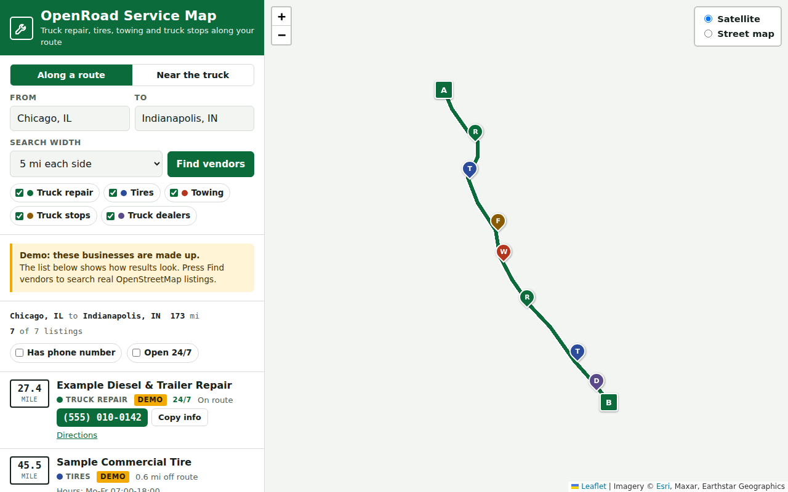
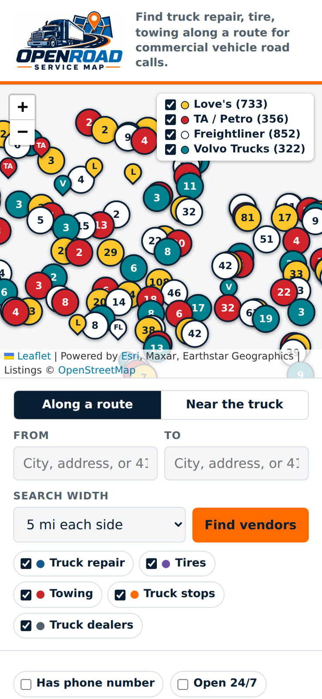

# OpenRoad Service Map

**Live site: https://canman555.github.io/OpenRoad-SeviceMap/**

A free, open source website for truck drivers and dispatchers setting up a road call. Enter a route, or where the truck is broken down, and it lists truck repair shops, tire shops, towing, truck stops and truck dealers near the route. Results are sorted by route mile and have tap-to-call phone numbers.



## Why

When a truck breaks down, a driver or dispatcher has to find a shop that can handle a heavy truck, near a specific spot on the highway, fast. Most of that searching happens on general map apps that mix in car shops and don't show where along the route each one sits. This site narrows the search to truck services in a corridor along the route and puts the phone number first.

## Features

- **Along a route:** search 3 to 25 miles each side of a route between two places.
- **Near the truck:** search around an address, town, coordinates, or the phone's location.
- **Route mile for every result**, plus how far off route it is.
- **Tap-to-call** numbers, hours, a 24/7 filter, and a "has phone number" filter.
- **Copy info** button that copies name, phone, address, route mile and coordinates for dispatch.
- **Satellite view** using public USDA aerial imagery, with an Esri satellite and a street map option.
- **Fix this listing** link on every result, so anyone can correct the data on OpenStreetMap.
- Works on phones, with light and dark themes.



## How it works (tech used)

It is one static file (`index.html`) with no server and no API keys, so it can be hosted free on GitHub Pages.

| Job | Service (free, public) |
| --- | --- |
| Map tiles | USDA NAIP aerial imagery (default, public domain, 2023-2025 flights) with USGS National Map imagery when zoomed out; Esri World Imagery and OpenStreetMap street map as options; Leaflet 1.9.4 |
| Place search | Nominatim (US, Canada, Mexico) |
| Route | OSRM public demo server, driving profile |
| Vendor search | Overpass API, searched in a corridor along the route |

Vendor types come from these OpenStreetMap tags: `shop=truck_repair`, `shop=tyres`, `shop=truck`, `shop=car_repair` with `hgv=yes` or a truck/diesel/fleet name, `amenity=fuel` with `hgv=yes` or a major truck stop brand name, and anything named "towing" or "wrecker".

## Limits to know about

- **Listings can be missing or out of date.** OpenStreetMap is maintained by volunteers. Always call ahead to confirm hours, heavy-truck capability and payment. Each result shows when its listing was last edited and links to fix it on OpenStreetMap.
- **Routes are car routes.** OSRM's public server does not know truck height, weight, length or hazmat restrictions. Use a truck GPS for the actual drive.
- **Public servers have usage limits.** Nominatim allows about one request per second, and the OSRM demo server and OSM tile servers are meant for light use. If traffic grows, point the URLs at your own or a paid provider.
- Mobile road service companies are rarely mapped in OpenStreetMap, so they mostly won't show up.

## Run locally

No build step and no API keys. Clone the repo and serve the folder:

```sh
git clone https://github.com/CANMAN555/OpenRoad-SeviceMap.git
cd OpenRoad-SeviceMap
python3 -m http.server 8000
```

Then open http://localhost:8000. Opening `index.html` directly also works in most browsers.

## License

MIT for the code. Map data © OpenStreetMap contributors, available under the ODbL.
